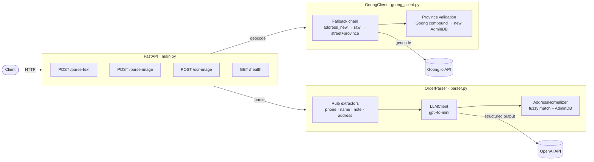
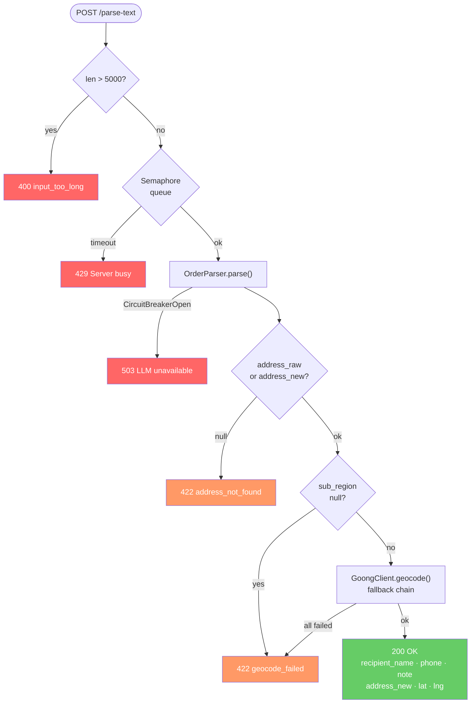
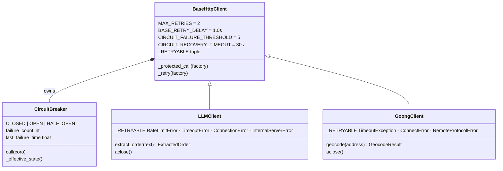
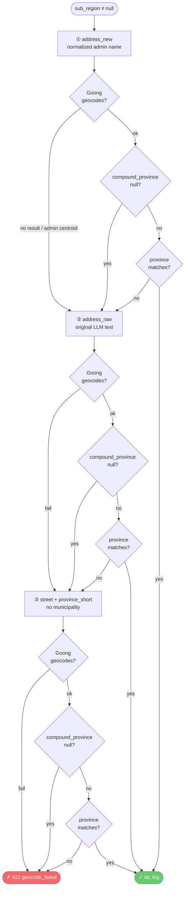

# Service Architecture

## Tổng quan

```
Client (HTTP)
    │
    ▼
┌─────────────────────────────────────────────────────────────────────────────┐
│  FastAPI  ·  main.py                                                        │
│                                                                             │
│  POST /parse-text          POST /parse-image         GET /health            │
│  POST /ocr-image           POST /normalize-address                          │
│                                                                             │
│  ┌──────────────────────────────────────────────────────────────────────┐   │
│  │  _parse_with_llm(text)                                               │   │
│  │                                                                      │   │
│  │  1. _check_input_length()  ──── > 5000 chars ──────► HTTP 400        │   │
│  │  2. asyncio.Semaphore(20)  ──── queue timeout ──────► HTTP 429       │   │
│  │  3. OrderParser.parse()    ──── circuit open  ──────► HTTP 503       │   │
│  │  4. address_not_found?     ──── no address    ──────► HTTP 422       │   │
│  │  5. _geocode_with_fallback() ── geocode fail  ──────► HTTP 422       │   │
│  │                                                                      │   │
│  │  → HTTP 200  { recipient_name, phone_number, note,                   │   │
│  │               address_raw, address_new, address_info, lat, lng }     │   │
│  └──────────────────────────────────────────────────────────────────────┘   │
└────────────┬──────────────────────────────────────┬────────────────────────┘
             │                                      │
             ▼                                      ▼
┌────────────────────────┐            ┌─────────────────────────────────┐
│  OrderParser           │            │  GoongClient                    │
│  parser.py             │            │  goong_client.py                │
│                        │            │                                 │
│  compact_text()        │            │  Fallback chain:                │
│  extract_phone()       │            │   1. address_new                │
│  mask_phone()          │            │   2. address_raw                │
│  extract_rule_hints()  │            │   3. street + province (short)  │
│  extract_rule_note()   │            │                                 │
│         │              │            │  Reject nếu:                    │
│         │              │            │  • No results                   │
│         ▼              │            │  • types ⊆ admin-only set       │
│  LLMClient.extract()   │            │  • province mismatch            │
│         │              │            │    (Goong old → new via AdminDB)│
│         ▼              │            │                                 │
│  AddressNormalizer     │            │  → GeocodeResult(lat, lng,      │
│         │              │            │    compound_province/district/  │
│         ▼              │            │    commune)                     │
│  ParseResponse         │            └─────────────────────────────────┘
└────────────────────────┘
```

---

## BaseHttpClient — Lớp hạ tầng dùng chung

```
app/services/base_client.py
│
├── CircuitBreakerOpenError   (exception)
├── _CBState                  CLOSED | OPEN | HALF_OPEN
├── _CircuitBreaker
│     ├── call(coro)
│     └── _effective_state()   OPEN → HALF_OPEN sau 30s
│
└── BaseHttpClient
      ├── MAX_RETRIES = 2        (3 lần tổng: 1 + 2 retry)
      ├── BASE_RETRY_DELAY = 1.0
      ├── CIRCUIT_FAILURE_THRESHOLD = 5
      ├── CIRCUIT_RECOVERY_TIMEOUT = 30.0s
      ├── _RETRYABLE = ()        (override ở subclass)
      │
      ├── _protected_call(factory)
      │     └── circuit.call( _retry(factory) )
      │
      └── _retry(factory)
            attempt 0 → factory()   [nếu lỗi]
            attempt 1 → sleep ~1.3s → factory()   [nếu lỗi]
            attempt 2 → sleep ~2.3s → factory()   [nếu lỗi → raise]
```

---

## LLMClient — Gọi OpenAI

```
LLMClient(BaseHttpClient)
│
├── _RETRYABLE = (RateLimitError, APITimeoutError,
│                 APIConnectionError, InternalServerError)
│
├── extract_order(text)
│     ├── [guardrail] len > 5000 → ValueError
│     ├── _protected_call(lambda: _single_call(text))
│     │     └── AsyncOpenAI.beta.chat.completions.parse(
│     │           model        = gpt-4o-mini
│     │           temperature  = 0
│     │           max_tokens   = 256
│     │           messages     = [system_prompt, user_text]
│     │           response_fmt = LLMOrderStrict (Pydantic)
│     │         )
│     │         → prompt cache tự động khi system_prompt > 1024 tokens
│     ├── _post_process()
│     │     ├── country phải = "VNM" nếu có địa chỉ
│     │     └── address_raw null → xóa trắng toàn bộ address_info
│     └── _to_internal()  → ExtractedOrder
│
└── System Prompt (~1200 tokens, static)
      ├── Schema JSON
      ├── 9 luật [R1–R9]
      └── 4 few-shot examples
            • Đơn đơn giản
            • Chị A giao cho anh B (2 người)
            • [Tên] ơi → courier, không phải người nhận
            • Đổi địa chỉ giao
```

---

## GoongClient — Geocoding

```
GoongClient(BaseHttpClient)
│
├── _RETRYABLE = (TimeoutException, ConnectError, RemoteProtocolError)
│
├── geocode(address)
│     └── _protected_call(lambda: _raw_geocode(address))
│
└── _raw_geocode(address)
      ├── GET rsapi.goong.io/geocode?address=...&api_key=...
      ├── Reject: results rỗng
      ├── Reject: types ⊆ {district, province, locality, ...}  ← centroid
      └── OK: types=[] hoặc house_number/route/establishment
            → GeocodeResult(lat, lng, compound_province, district, commune)
```

---

## Geocode Fallback Chain & Province Validation

```
_geocode_with_fallback(ParseResponse)
│
├── Candidate 1: address_new   (đã chuẩn hóa theo AdminDB)
├── Candidate 2: address_raw   (nguyên văn từ LLM)
└── Candidate 3: number + street + province_short
      (bỏ municipality — tránh lỗi tên hành chính cũ/mới)
      province_short = strip("Thủ Đô" | "Thành Phố" | "Tỉnh")

Với mỗi candidate:
   geocode() → GeocodeResult
       │
       └── _province_matches(geo, expected_sub_region)?
             ├── Map Goong compound (hệ cũ) → tỉnh mới
             │   via AddressNormalizer DB
             ├── strip_accents + so sánh chuỗi
             └── Không khớp → thử candidate tiếp theo
```

---

## AddressNormalizer — Chuẩn hóa địa chỉ Việt Nam

```
AddressNormalizer
│
├── DB: vietnam_administrative.json
│     mỗi ward: { tên mới, mã, tỉnh mới, mã tỉnh,
│                 old_ward, old_district, old_province }
│
├── normalize(ExtractedAddress) → NormalizedAddress
│     ├── Fuzzy match ward + province (rapidfuzz)
│     ├── Threshold: FUZZY_THRESHOLD = 84
│     ├── is_normalized = True khi score ≥ threshold AND không ambiguous
│     └── Trả tên mới (post-2025) nếu match
│
├── infer_province_from_municipality(name)
│     └── Tra unique_municipality_map
│           (ward/district chỉ thuộc 1 tỉnh → trả tỉnh đó)
│
└── _score(query, candidate)
      ├── fuzz.ratio           (chính xác vị trí)
      └── fuzz.token_sort_ratio (nếu ratio ≥ 60, tránh đảo token)
```

---

## Luồng xử lý đầy đủ một request

```
POST /parse-text  {"text": "..."}
│
├─[1] Kiểm tra độ dài ≤ 5000 ký tự
│
├─[2] Acquire semaphore (max 20 concurrent LLM calls)
│
├─[3] compact_text() + extract_phone() + mask_phone()
│     extract_rule_hints() → rule_name, rule_address
│     extract_rule_note()  → rule_note
│
├─[4] LLMClient.extract_order(llm_input)
│     ├── gpt-4o-mini → LLMOrderStrict (JSON structured output)
│     └── _to_internal() → ExtractedOrder
│
├─[5] Merge: regex_phone > LLM phone
│            rule_name nếu LLM không tìm được
│            rule_note nếu LLM không tìm được
│
├─[6] AddressNormalizer.normalize()
│     ├── is_normalized=True  → dùng ward/province từ normalizer
│     └── is_normalized=False → dùng raw từ LLM (tránh sai tỉnh)
│
├─[7] Build address_new (chuỗi địa chỉ chuẩn)
│
├─[8] address_raw/new null → HTTP 422 address_not_found
│
└─[9] GoongClient._geocode_with_fallback()
      ├── Thử address_new → address_raw → street+province
      ├── Validate province (old→new mapping)
      └── → lat, lng
```

---

## Error Codes

| HTTP | detail | Nguyên nhân |
|---|---|---|
| 400 | `input_too_long` | Text > 5000 ký tự |
| 422 | `address_not_found` | Không tìm ra địa chỉ |
| 422 | `geocode_failed` | sub_region null, hoặc Goong không resolve được |
| 429 | `Server busy...` | Semaphore queue timeout |
| 503 | `LLM service unavailable` | Circuit breaker OPEN |

---

## Mermaid Diagrams

> Paste từng block vào **[mermaid.live](https://mermaid.live)** để xem interactive.

---

### 1. Tổng quan hệ thống



---

### 2. Luồng xử lý một request



---

### 3. BaseHttpClient — kế thừa OOP



---

### 4. Geocoding fallback chain



---

## Cấu trúc file

```
app/
├── core_config.py              Settings (pydantic, từ .env)
├── schemas/
│   └── order.py                ParseResponse, LLMOrderStrict, ...
├── pipeline/
│   ├── parser.py               OrderParser (async)
│   ├── address_normalizer.py   Fuzzy match + AdminDB
│   ├── phone_extractor.py      Regex phone VN
│   ├── rule_extractor.py       Rule-based name/address/note
│   ├── text_utils.py           compact_text, normalize_key
│   └── ocr.py                  OCR image → text
└── services/
    ├── base_client.py          BaseHttpClient + CircuitBreaker
    ├── llm_client.py           LLMClient(BaseHttpClient)
    └── goong_client.py         GoongClient(BaseHttpClient)
main.py                         FastAPI app + endpoints
```
