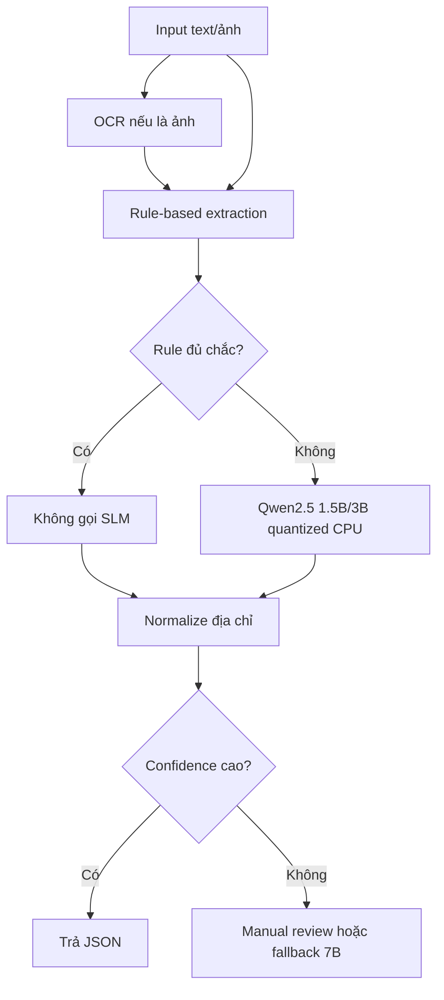

# Tối Ưu Chạy Model Trên CPU

Mục tiêu của giai đoạn này là giảm chi phí cloud GPU bằng cách chạy model nhỏ/quantized trên CPU, đồng thời dùng rule-based để giảm số lần gọi SLM.

## 1. Ý Tưởng Chính

Self-host không tự động đồng nghĩa latency thấp. Với CPU, cần tối ưu theo 3 hướng:

```text
1. Giảm số lần gọi model
2. Giảm token prompt/output mỗi lần gọi
3. Dùng model nhỏ/quantized
```

Kiến trúc đề xuất:



## 2. Cấu Hình CPU Fast Mode

Trong `.env`, bật:

```env
CPU_FAST_MODE=true
ENABLE_LLM=true
LLM_PROVIDER=openai_compatible
LLM_BASE_URL=http://host.docker.internal:11434/v1
LLM_MODEL=qwen2.5:3b
LLM_API_KEY=ollama
LLM_TIMEOUT_SECONDS=180
LLM_MAX_TOKENS=180
LLM_NUM_CTX=1024
LLM_KEEP_ALIVE=10m
```

Ý nghĩa:

- `CPU_FAST_MODE=true`: nếu rule-based đã đủ chắc thì bỏ qua SLM.
- `LLM_MAX_TOKENS=180`: giới hạn output token để model không sinh dài.
- `LLM_NUM_CTX=1024`: giảm context window để tiết kiệm CPU/RAM.
- `LLM_KEEP_ALIVE=10m`: giữ model warm trong Ollama.

## 3. Khi Nào Bỏ Qua SLM?

Trong fast mode, pipeline sẽ bỏ qua SLM nếu rule-based bắt được:

- `phone`
- `name`
- `note`
- ít nhất 2 tín hiệu địa chỉ trong:
  - province
  - ward
  - street
  - house_number

Ví dụ:

```text
anh Nam 0901123493 giao số 21/3 hẻm 6 đường Lê Lợi, Xã Vĩnh Hanh, Huyện Châu Thành, An Giang. note: giao giờ hành chính
```

Case này có thể parse bằng rule + mapping DB, không cần gọi SLM.

## 4. Model Nên Thử Trên CPU

Thứ tự thử nghiệm:

```bash
ollama pull qwen2.5:1.5b
ollama pull qwen2.5:3b
```

Khuyến nghị:

| Model | Vai trò | Nhận xét |
|---|---|---|
| `qwen2.5:1.5b` | CPU rẻ nhất | Nên thử nếu rule-based mạnh |
| `qwen2.5:3b` | CPU cân bằng | Ứng viên chính cho CPU deployment |
| `qwen2.5:7b` | fallback chất lượng cao | CPU thường chậm, nên dùng GPU hoặc chỉ fallback |

## 5. Chạy Benchmark CPU

Đổi `.env`:

```env
LLM_MODEL=qwen2.5:3b
CPU_FAST_MODE=true
LLM_MAX_TOKENS=180
LLM_NUM_CTX=1024
```

Recreate container:

```bash
docker compose up -d --force-recreate api
```

Smoke test 20 mẫu trước:

```bash
docker compose exec -T api python scripts/run_benchmark.py \
  --api-url http://127.0.0.1:8000 \
  --input data/benchmark_orders_200.jsonl \
  --output-dir benchmark_results/qwen25_3b_cpu_fast_smoke \
  --model-name qwen2.5:3b-cpu-fast \
  --warmup 2 \
  --limit 20 \
  --concurrency 1 \
  --timeout 180
```

Nếu latency ổn, chạy full:

```bash
docker compose exec -T api python scripts/run_benchmark.py \
  --api-url http://127.0.0.1:8000 \
  --input data/benchmark_orders_200.jsonl \
  --output-dir benchmark_results/qwen25_3b_cpu_fast_full \
  --model-name qwen2.5:3b-cpu-fast \
  --warmup 5 \
  --concurrency 1 \
  --timeout 180
```

## 6. Chạy Ollama CPU

Trên server CPU-only:

```bash
ollama pull qwen2.5:3b
OLLAMA_HOST=0.0.0.0:11434 ollama serve
```

Nếu chạy bằng systemd:

```bash
sudo mkdir -p /etc/systemd/system/ollama.service.d
sudo tee /etc/systemd/system/ollama.service.d/override.conf > /dev/null <<'EOF'
[Service]
Environment="OLLAMA_HOST=0.0.0.0:11434"
EOF
sudo systemctl daemon-reload
sudo systemctl restart ollama
```

Kiểm tra:

```bash
curl http://127.0.0.1:11434/api/tags
```

## 7. Kỳ Vọng Thực Tế

CPU quantized sẽ rẻ hơn GPU nhiều, nhưng latency sẽ tăng nếu request nào cũng gọi model.

Vì vậy mục tiêu không phải là “CPU gọi LLM nhanh như GPU”, mà là:

```text
Phần lớn request chạy rule-only rất nhanh.
Chỉ request mơ hồ mới gọi Qwen CPU.
Request quá khó thì manual review hoặc fallback model lớn.
```

## 8. Hướng Tối Ưu Tiếp Theo

- Tách model chỉ trả `name`, `note`, `address_raw` để giảm output token.
- Cache kết quả theo hash input.
- Thêm confidence score cho rule-based extraction.
- Tối ưu rule note để giảm phụ thuộc SLM.
- Benchmark riêng:
  - rule-only
  - CPU fast mode
  - CPU always LLM
  - GPU 3B
  - GPU 7B

