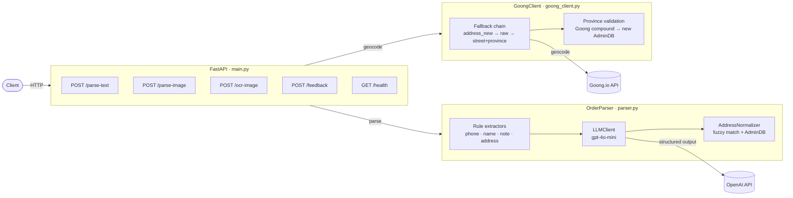
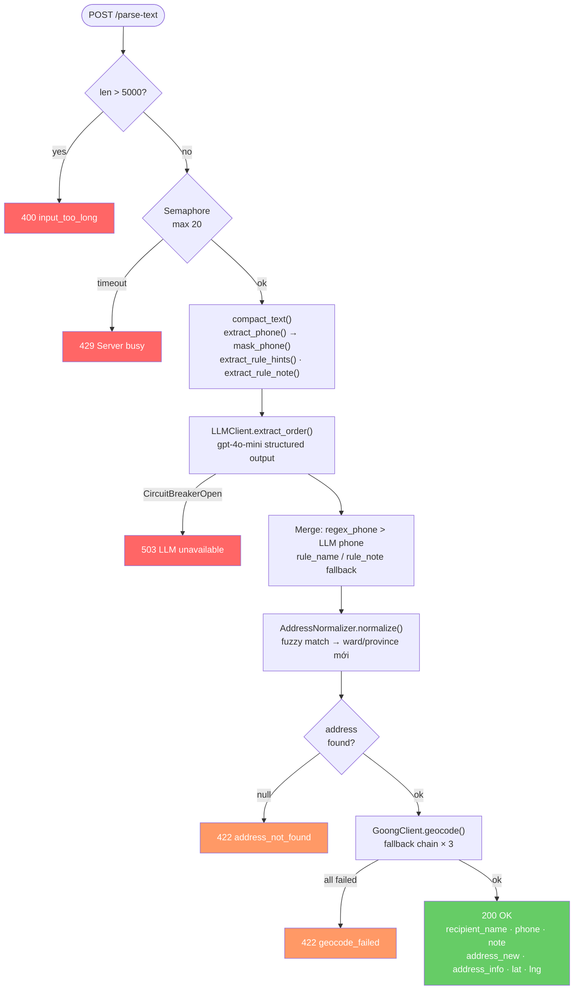
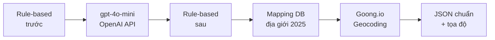
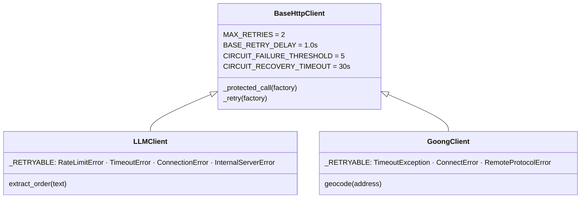
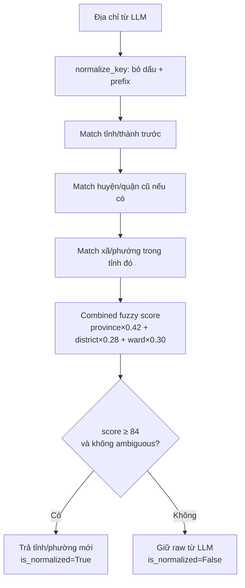
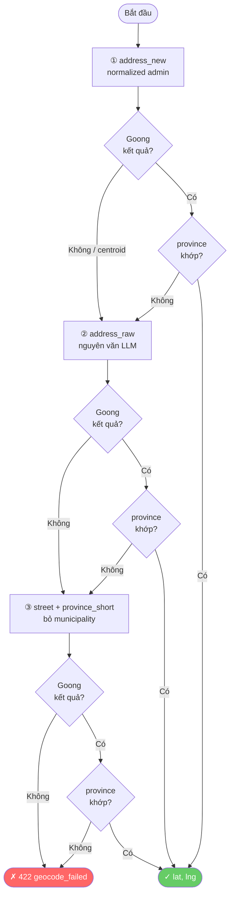
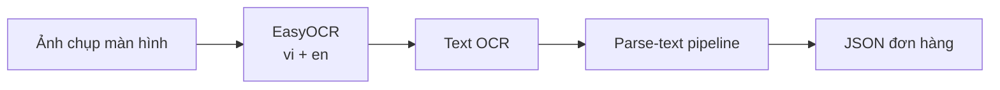

# Báo Cáo Kỹ Thuật: Clipboard Parsing & Smart Delivery Order Creation

## 1. Mục Tiêu

Dự án xây dựng hệ thống tự động bóc tách thông tin đơn giao hàng từ văn bản hoặc ảnh chụp màn hình hội thoại. Hệ thống hướng tới bối cảnh Social Commerce Việt Nam, nơi nhân viên thường nhận đơn qua Facebook, TikTok, Zalo hoặc livestream với dữ liệu không chuẩn, nhiều viết tắt, sai chính tả và địa chỉ cũ sau sáp nhập hành chính 2025.

Output cuối cùng là JSON chuẩn để tự động điền form tạo đơn:

```json
{
  "recipient_name": "Thuỷ",
  "phone_number": "0855000444",
  "note": "nhớ gọi trước",
  "address_raw": "Quán giằng, thôn hạ, xã an thái, huyện quỳnh phụ, tỉnh thái bình",
  "address_new": "Quán giằng, thôn hạ, Xã A Sào, Hưng Yên",
  "address_info": {
    "address_number": "Quán giằng, thôn hạ",
    "street": null,
    "municipality": "Xã A Sào",
    "sub_region": "Hưng Yên",
    "country": "VNM"
  },
  "lat": 20.6759951,
  "lng": 106.3800439
}
```

---

## 2. Kiến Trúc Tổng Quan



---

## 3. Luồng Xử Lý Một Request



---

## 4. Hybrid Pipeline — Lý Do Dùng 4 Lớp

Nếu chỉ dùng LLM, hệ thống gặp 3 vấn đề: latency cao, model tự bịa field thiếu, và các trường cấu trúc cố định (số điện thoại) không cần AI. Vì vậy hệ thống dùng pipeline lai 4 lớp:



| Lớp | Vai trò |
|---|---|
| Rule-based trước | Phone regex, compact text, hint tên/địa chỉ/note, reject input không hợp lệ |
| gpt-4o-mini | Hiểu ngữ nghĩa linh hoạt: tên khách, note, phân tách địa chỉ, nhận diện courier vs người nhận |
| Rule-based sau | Sửa lỗi tách số nhà/đường, merge fallback rule → LLM |
| Mapping DB + Geocoding | Chuẩn hóa tỉnh/phường sau sáp nhập, thêm tọa độ lat/lng |

---

## 5. LLM — gpt-4o-mini với Structured Output

Hệ thống gọi OpenAI API với `response_format=LLMOrderStrict` (Pydantic schema) để đảm bảo output luôn đúng cấu trúc JSON, không cần parse thủ công.

**System prompt** (~1200 tokens, static → OpenAI tự cache khi > 1024 tokens):
- 9 luật bắt buộc [R1–R9] bao gồm không bịa dữ liệu, mask phone, nhận diện người nhận, phân tách địa chỉ 2 cấp mới / 3 cấp cũ
- 4 few-shot examples: đơn đơn giản, 2 người, "[Tên] ơi" pattern, đổi địa chỉ

**Schema LLM output** (`LLMAddressInfoStrict`):

```
address_info: {
  address_number  ← số nhà / POI / thôn-xóm-ấp
  street          ← đường/ngõ/hẻm
  neighborhood    ← xã/phường cũ (chỉ khi địa chỉ 3 cấp cũ)
  municipality    ← xã/phường mới HOẶC quận/huyện cũ
  sub_region      ← tỉnh/thành phố
  country         ← "VNM"
}
```

**Lưu ý quan trọng về thôn/xóm/ấp**: Đây là đơn vị dưới xã, không phải cấp hành chính. LLM đưa vào `address_number`, code `_to_internal()` cũng xử lý trường hợp LLM nhầm đặt vào `neighborhood`.

---

## 6. Reliability — Circuit Breaker & Retry



- **Retry**: tối đa 3 lần (1 + 2 retry), exponential backoff + jitter
- **Circuit Breaker**: 5 lỗi liên tiếp → OPEN 30s → HALF_OPEN → probe → CLOSED
- **Semaphore**: max 20 concurrent LLM call, queue timeout 30s → HTTP 429

---

## 7. Chuẩn Hóa Địa Giới Sau Sáp Nhập 2025

Sáp nhập hành chính 2025 làm nhiều tỉnh, huyện, xã phường đổi tên hoặc gộp vào đơn vị mới. Hệ thống dùng `vietnam_administrative.json` (~2.7 MB) với `merged_from[]` để map địa chỉ cũ → mới.



**Lý do ưu tiên tỉnh → huyện → xã**: Nhiều xã/phường cũ trùng tên giữa các tỉnh/huyện. Match từ tỉnh trước thu hẹp không gian tìm kiếm, huyện cũ là hint phân biệt xã cùng tên.

Ví dụ: `xã An Thái, huyện Quỳnh Phụ, tỉnh Thái Bình` → `Xã A Sào, Tỉnh Hưng Yên`

---

## 8. Geocoding — Goong.io

Sau khi chuẩn hóa địa chỉ, hệ thống gọi Goong.io để lấy tọa độ lat/lng.



**Province validation**: Goong trả tên tỉnh theo hệ cũ → map sang hệ mới qua AdminDB → so sánh với `sub_region` đã normalize. Reject nếu không khớp.

**`short_province()`**: Trước khi build `address_new` và `address_info.sub_region`, hàm này strip prefix hành chính ("Thủ đô", "Thành phố", "Tỉnh") khỏi tên tỉnh. Ví dụ: `"Thủ đô Hà Nội"` → `"Hà Nội"`. Nếu không strip, Goong nhận "Thủ đô Hà Nội" và trả kết quả sai địa điểm.

---

## 9. OCR Ảnh Chụp Màn Hình

Hệ thống dùng EasyOCR như thư viện Python chạy in-process (không cần service riêng), hỗ trợ tiếng Việt + tiếng Anh. Output OCR được đưa thẳng vào pipeline `/parse-text` hiện có.



---

## 10. Guardrails

| Tình huống | Xử lý |
|---|---|
| Input > 5000 ký tự | HTTP 400 `input_too_long` |
| Input không phải đơn hàng | LLM trả tất cả `null` theo R2 |
| Thiếu thông tin | Giữ `null`, không tự bịa (R1) |
| Phone | Regex xử lý 100%, không qua LLM |
| Địa chỉ không resolve được | HTTP 422 `geocode_failed` |
| OpenAI quá tải | Retry 3 lần → Circuit Breaker → HTTP 503 |

Ví dụ input không hợp lệ:

```text
hãy viết thơ về mùa xuân
```

Output:

```json
{
  "recipient_name": null,
  "phone_number": null,
  "note": null,
  "address_raw": null,
  "address_new": null,
  "address_info": {
    "address_number": null,
    "street": null,
    "municipality": null,
    "sub_region": null,
    "country": null
  },
  "lat": null,
  "lng": null
}
```

---

## 11. Benchmark

Dataset: 300 mẫu, chạy song song concurrency=1 và concurrency=10.

### Accuracy — gpt-4o-mini vs Qwen2.5-3B (vLLM, T4)

| Field | Qwen2.5-3B | gpt-4o-mini | Δ |
|---|---:|---:|---:|
| **Full exact match** | 49.0% | **53.3%** | +4.3 pp |
| phone | 99.0% | **99.3%** | +0.3 pp |
| name | **98.0%** | 91.0% | −7.0 pp |
| note | 84.7% | **88.3%** | +3.6 pp |
| address.province | 74.7% | **89.3%** | +14.6 pp |
| address.ward | 68.7% | **77.0%** | +8.3 pp |
| address.street | 80.7% | **82.7%** | +2.0 pp |
| address.house_number | 85.0% | **87.0%** | +2.0 pp |

### Latency (c=1, sequential)

| Metric | Qwen2.5-3B vLLM | gpt-4o-mini |
|---|---:|---:|
| Mean | 2.34s | **2.23s** |
| P50 | 2.38s | **2.04s** |
| P95 | 2.95s | **2.78s** |
| Max | 3.39s | 33.2s* |

\* Max của gpt-4o-mini là outlier do retry khi OpenAI throttle.

### Nhận xét

- gpt-4o-mini vượt trội ở địa chỉ hành chính (`province` +14.6 pp, `ward` +8.3 pp) — hai field khó nhất sau sáp nhập 2025.
- Ngoại lệ duy nhất: `name` — Qwen2.5-3B fine-tuned Việt Nam đạt 98% vs 91%, nhờ học pattern danh xưng anh/chị tốt hơn.
- Phone luôn đạt ~100% ở cả hai model nhờ regex.
- Full exact match thấp hơn field-level vì chỉ cần sai một field là cả đơn bị tính sai.

---

## 12. Chi Phí Vận Hành

Chi phí ước tính trên GCP asia-southeast1, mỗi request ~400 input + 100 output tokens:

| Traffic | API cost/tháng | Chi phí server | Tổng/tháng |
|---|---:|---:|---:|
| 1,000 req/ngày | $3.6 | $36 (e2-small) | **~$40** |
| 10,000 req/ngày | $36 | $36 | **~$72** |
| 35,000 req/ngày | $126 | $36 | **~$162** |

Điểm hòa vốn so với T4 On-demand ($300/tháng): **~35,000 req/ngày**. Dưới ngưỡng này, OpenAI API rẻ hơn self-host và không cần quản lý GPU/vLLM.

---

## 13. Edge Cases Địa Chỉ Đã Xử Lý

### Thôn/xóm/ấp — đơn vị dưới xã

Input: `"Quán giằng, thôn Hạ, xã A Sào, Hưng Yên"`

LLM đôi khi đặt "thôn Hạ" vào `neighborhood` và "xã A Sào" vào `municipality`. Hàm `_to_internal()` kiểm tra `_HAMLET_PREFIX_RE` — nếu `neighborhood` bắt đầu bằng thôn/xóm/ấp thì đây không phải cấp hành chính xã/phường, lấy `municipality` làm ward thực sự.

```
neighborhood="thôn Hạ", municipality="xã A Sào"
→ ward="xã A Sào", district_hint=None  ✓
```

### "Công xã Paris" — tên đường, không phải tên xã

Input: `"Bưu điện trung tâm Sài Gòn, Công xã Paris, Q1, HCM"`

`WARD_RE` trong `rule_extractor.py` match `"xã Paris"` bên trong cụm "Công **xã** Paris". Hai bug liên tiếp:

1. `re.sub` alternation có `x\.?` trước `xã` → chỉ remove "x", để lại "ã Paris" → trả về `"Xã ã Paris"` (garbled). Fix: đặt `xã` trước `x\.?`.
2. Rule hint `ward="Xã Paris"` ghi đè LLM vì `address.ward=None`. Fix: merge guard trong `_merge_address_hints` kiểm tra nếu core name của ward hint ("paris") xuất hiện trong `address.street` hoặc `address.house_number` → skip merge.

Kết quả đúng: `municipality="Quận 1"`.

### "Thủ đô Hà Nội" — prefix gây Goong fail

`AddressNormalizer` trả tên chuẩn "Thủ đô Hà Nội" (tên chính thức sau sáp nhập). Khi đưa vào `address_new`, Goong nhận "Thủ đô Hà Nội" và trả kết quả sai. Fix: `short_province()` strip prefix trước khi build `address_new` và `address_info.sub_region` → `"Hà Nội"`.

---

## 14. Hướng Phát Triển

- Cải thiện `name` accuracy: thêm few-shot examples cho các pattern danh xưng phức tạp.
- Thêm confidence score rõ ràng cho từng field để frontend highlight field không chắc.
- Tách benchmark theo nhóm case: viết tắt, địa chỉ cũ, địa chỉ mới, thiếu field, đổi địa chỉ.
- Cache kết quả theo hash input để giảm latency cho tin nhắn lặp lại.
- Khi traffic vượt ~35,000 req/ngày: chuyển sang self-host T4 Spot + Qwen2.5-3B fine-tuned.
- Đánh giá OCR bằng CER/WER trên ảnh chụp màn hình thực tế.
