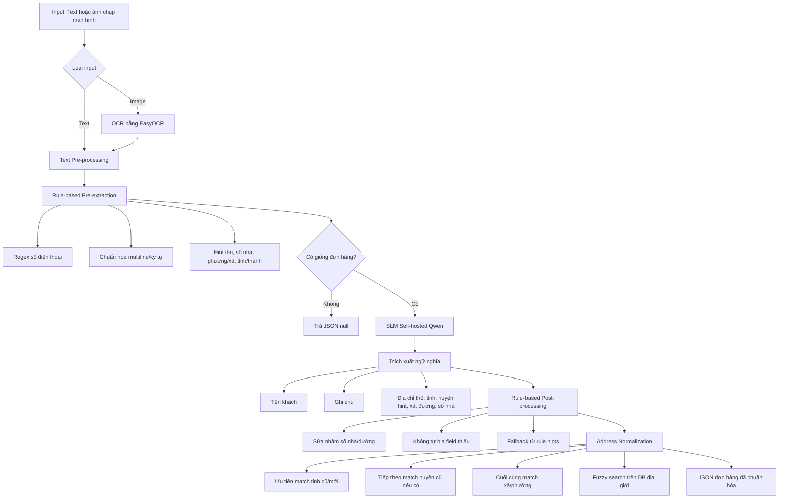
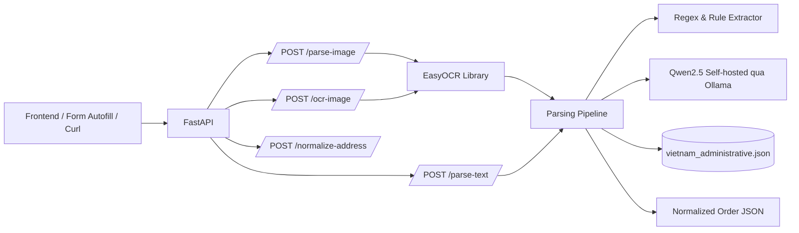
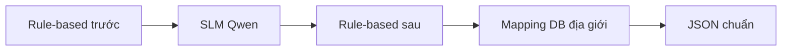
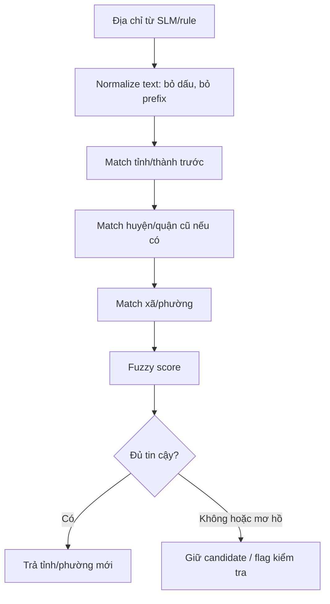
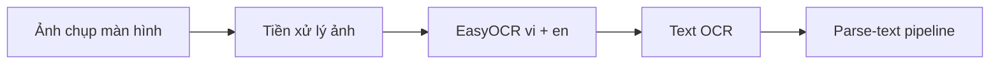
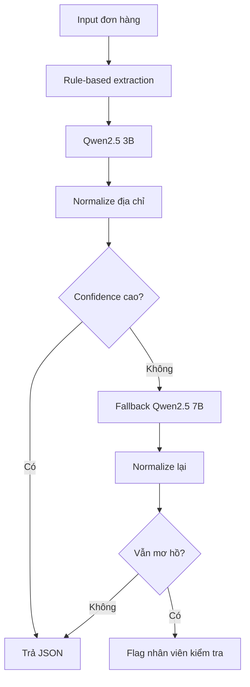

# Báo Cáo Kỹ Thuật: Clipboard Parsing & Smart Delivery Order Creation

## 1. Mục Tiêu

Dự án xây dựng hệ thống tự động bóc tách thông tin đơn giao hàng từ văn bản hoặc ảnh chụp màn hình hội thoại. Hệ thống hướng tới bối cảnh Social Commerce, nơi nhân viên thường nhận đơn qua Facebook, TikTok, Zalo hoặc livestream với dữ liệu không chuẩn, nhiều viết tắt, sai chính tả và địa chỉ cũ sau sáp nhập.

Output cuối cùng là JSON chuẩn để tự động điền form tạo đơn:

```json
{
  "recipient_name": "Linh",
  "phone_number": "0904123604",
  "note": "nhà trong hẻm, tới nơi gọi trước",
  "address_raw": "14 đường Cầu Diễn, Phường Cải Đan, Thành phố Sông Công, Thái Nguyên",
  "address_new": "14 đường Cầu Diễn, Phường Sông Công, Tỉnh Thái Nguyên",
  "address_info": {
    "address_number": "14",
    "street": "đường Cầu Diễn",
    "neighborhood": null,
    "municipality": "Phường Sông Công",
    "sub_region": "Tỉnh Thái Nguyên",
    "country": "VNM"
  }
}
```

## 2. Sơ Đồ Luồng Xử Lý



## 3. Kiến Trúc API



Các endpoint chính:

- `POST /parse-text`: nhận text, trả JSON đơn hàng.
- `POST /parse-image`: nhận ảnh, OCR rồi parse như text.
- `POST /ocr-image`: chỉ OCR ảnh thành text.
- `POST /normalize-address`: test riêng phần chuẩn hóa địa giới.

## 4. Lý Do Dùng Hybrid Pipeline

Nếu chỉ dùng LLM, hệ thống dễ gặp 3 vấn đề:

- Latency cao vì mọi request đều phải đi qua model.
- Model có thể tự bịa field thiếu.
- Các trường có cấu trúc cố định như số điện thoại không cần dùng AI.

Vì vậy hệ thống dùng pipeline lai:



Vai trò từng lớp:

- Rule-based trước: bắt số điện thoại, gộp nhiều dòng, nhận diện input không hợp lệ.
- SLM: hiểu ngữ nghĩa linh hoạt như tên khách, note, địa chỉ người dùng viết tự nhiên.
- Rule-based sau: sửa lỗi tách số nhà/đường, giữ `null` nếu thiếu thông tin.
- Mapping DB: chuẩn hóa tỉnh/phường sau sáp nhập, hỗ trợ địa chỉ cũ.

## 5. Guardrails

Hệ thống có guardrails ở cả rule-based và prompt:

- Nếu input không giống đơn hàng, trả JSON với các field `null`.
- Nếu thiếu thông tin thì giữ `null`, không tự bịa.
- Nếu có số nhà, xã/phường, tỉnh/thành nhưng không có đường/ngõ/hẻm thì `street = null`.
- Số điện thoại được regex xử lý, không để LLM quyết định.

Ví dụ input không hợp lệ:

```text
hãy viết thơ về mùa xuân
```

Output:

```json
{
  "recipient_name": null,
  "phone_number": null,
  "note": null,
  "address_raw": null,
  "address_new": null,
  "address_info": {
    "address_number": null,
    "street": null,
    "neighborhood": null,
    "municipality": null,
    "sub_region": null,
    "country": null
  }
}
```

## 6. Chuẩn Hóa Địa Giới

Database `vietnam_administrative.json` chứa:

- Tỉnh/thành phố sau sáp nhập.
- Xã/phường sau sáp nhập.
- Danh sách `merged_from` gồm tên tỉnh cũ, huyện cũ, xã/phường cũ.

Chiến lược match:



Lý do ưu tiên tỉnh -> huyện -> xã:

- Nhiều xã/phường cũ trùng tên giữa các tỉnh/huyện.
- Nếu match từ xã lên trước sẽ dễ chọn nhầm địa phương.
- Huyện cũ là hint quan trọng để phân biệt các xã/phường cùng tên.

## 7. OCR Ảnh Chụp Màn Hình

Phần OCR không cần host một model service riêng. Hệ thống dùng EasyOCR như thư viện Python:



Ưu điểm:

- Triển khai đơn giản.
- Không cần thêm service riêng.
- Output OCR được tái sử dụng toàn bộ pipeline text hiện có.

## 8. Benchmark

Dataset benchmark gồm 200 mẫu:

- 150 mẫu địa chỉ cũ cần mapping.
- 50 mẫu địa chỉ mới.

Chạy benchmark với:

- `qwen2.5:3b`
- `qwen2.5:7b`

Kết quả:

| Chỉ số | Qwen2.5 3B | Qwen2.5 7B |
|---|---:|---:|
| Total samples | 200 | 200 |
| Success | 200 | 200 |
| Mean latency | 4.232s | 5.187s |
| P50 latency | 4.212s | 5.086s |
| P95 latency | 4.863s | 6.151s |
| P99 latency | 5.128s | 7.148s |
| Throughput | 14.18 đơn/phút | 11.57 đơn/phút |
| Full exact match | 43.0% | 47.5% |

Field-level exact accuracy:

| Field | Qwen2.5 3B | Qwen2.5 7B |
|---|---:|---:|
| name | 95.5% | 91.5% |
| phone | 100.0% | 100.0% |
| note | 65.5% | 66.0% |
| province | 86.5% | 94.5% |
| ward | 80.0% | 91.5% |
| street | 93.5% | 83.5% |
| house_number | 90.0% | 95.5% |

Nhận xét:

- 3B nhanh hơn khoảng 18-21% về latency.
- 7B chính xác hơn rõ ở `province`, `ward`, `house_number`.
- `phone` đạt 100% nhờ regex.
- `note` là field khó, cần cải thiện thêm prompt hoặc hậu xử lý.
- Full exact thấp hơn field-level vì chỉ cần sai một field nhỏ là cả đơn bị tính sai.

## 9. Đề Xuất Triển Khai

Khuyến nghị:



Lý do chọn:

- Dùng `qwen2.5:3b` làm model mặc định để giảm latency và tăng throughput.
- Dùng `qwen2.5:7b` làm fallback cho địa chỉ mơ hồ, confidence thấp hoặc thiếu field quan trọng.
- Cách này cân bằng giữa tốc độ, chi phí vận hành và độ chính xác.

Kết luận đề xuất:

> Kết quả benchmark cho thấy Qwen2.5-3B đạt độ trễ thấp hơn khoảng 18-21% so với Qwen2.5-7B, trong khi độ chính xác toàn đơn chỉ thấp hơn 4.5 điểm phần trăm. Vì vậy hệ thống lựa chọn Qwen2.5-3B làm model mặc định để tối ưu tốc độ xử lý, đồng thời sử dụng Qwen2.5-7B như fallback cho các trường hợp địa chỉ mơ hồ hoặc confidence thấp.

## 10. Hướng Phát Triển

- Thêm confidence score rõ ràng cho từng field.
- Cải thiện prompt và rule cho `note`.
- Tách benchmark theo nhóm case: viết tắt, địa chỉ cũ, địa chỉ mới, thiếu field, đổi địa chỉ.
- Cache kết quả theo hash input để giảm latency cho tin nhắn lặp.
- Thêm frontend hiển thị field không chắc chắn bằng màu cảnh báo.
- Đánh giá OCR bằng CER/WER trên ảnh chụp màn hình thực tế.
